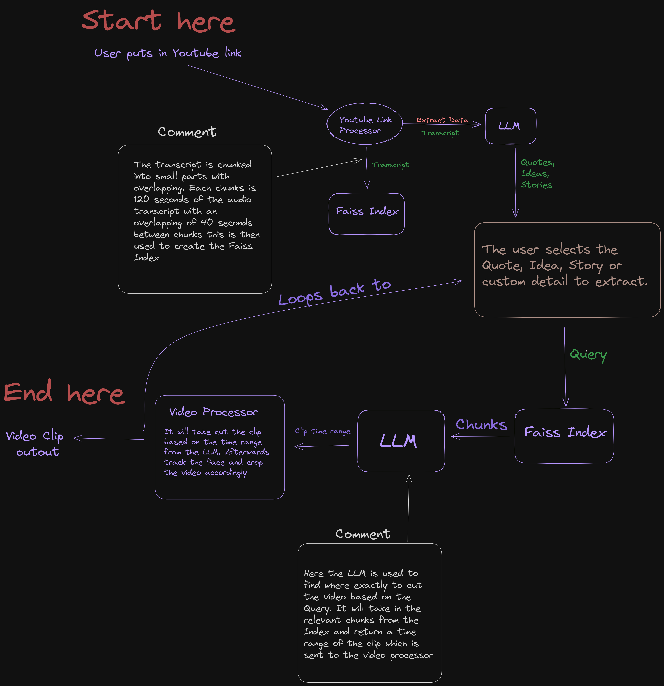

# 🚀🎬 VividCut-AI

## (Note: VividCut-AI is a powerful tool for automating video editing processes with AI)

<p align="center">
  <a href="https://discord.gg/gVCBcfSH">
    
  </a>
  <a href="https://github.com/Mbonea-Mjema/VividCut-AI/stargazers">
    
  </a>
  <a href="https://github.com/Mbonea-Mjema/VividCut-AI/releases">
    
  </a>
  <a href="https://github.com/Mbonea-Mjema/VividCut-AI/wiki">
    
  </a>  
</p>

<div align="center" style="border-radius: 20px;" width="18%">
    
</div>
<div align="center">
  <a href="https://discord.gg/gVCBcfSH">
    
  </a>
</div>

<div align="center">
⚡ Automating video editing and processing with AI ⚡
</div>
</br>

Follow the installation steps below for running VividCut-AI locally.
Please read "installation-notes.md" for more details.

## 🛠️ Workflow



## 🎥 Showcase

Here’s a demonstration of VividCut-AI's capabilities:

### Before Processing

<video width="320" height="240" controls>
  <source src="Sample/downloaded_video_segment_1.mp4" type="video/mp4">
  Your browser does not support the video tag.
</video>

### After Processing

<video width="320" height="240" controls>
  <source src="Sample/0_final_video.mp4" type="video/mp4">
  Your browser does not support the video tag.
</video>

These examples illustrate the transformation from a raw video segment to a fully processed clip, showcasing the power of VividCut-AI.

## ☕ Buy Me a Coffee

If you appreciate the work and would like to support future developments, consider buying me a coffee!

<a href="https://buymeacoffee.com/telegramsui" target="_blank"></a>

## 🛠️ How it works

VividCut-AI is a powerful framework for automating video editing processes. It simplifies tasks such as video clipping, content extraction, and face tracking.

- 🎞️ **Automated editing framework**: Streamlines the video editing process using AI-driven techniques.

- 📃 **Content Extraction**: Extracts relevant segments based on user queries using a Faiss index built with `Alibaba-NLP/gte-large-en-v1.5` embeddings.

- 🗣️ **Face Tracking and Cropping**: Automatically tracks and crops faces in videos using YOLO models.

- 🔗 **Video Clipping**: Clips and processes video segments based on AI-identified content.

- 🌐🎥 **Automation**: Automates the video processing workflow, making it easier for content creators to produce high-quality videos.

## 🚀 Quick Start: Run VividCut-AI

To run VividCut-AI locally, follow these steps:

1. **Clone the Repository**:

   ```bash
   git clone https://github.com/Mbonea-Mjema/VividCut-AI.git
   cd VividCut-AI
   ```

2. **Install the Dependencies**:

   ```bash
   pip install -r requirements.txt
   sudo apt-get install ffmpeg
   ```

3. **Run the CLI**:

   ```bash
   python CLI.py --video_id <YOUTUBE_VIDEO_ID>
   ```

4. **Don't forget to include your Groq API key** in the `CLI.py` code to enable the AI functionalities.

## Framework Overview

- 🎬 The `AIEditor` component processes video transcripts and identifies key segments.

- 🎥 The `VideoProcessor` component handles video clipping, face tracking, and cropping.

💡 VividCut-AI offers powerful tools for automating video editing, making it an essential tool for content creators.

## Technologies Used

VividCut-AI utilizes the following technologies:

- **Faiss**: For fast and efficient similarity search.
- **Moviepy**: For video processing and editing.
- **OpenAI**: For AI-driven content extraction and processing.
- **YOLO**: For object detection and face tracking in video.

These technologies provide a robust framework for automating video editing processes.

## 💁 Contributing

As an open-source project, we welcome contributions, whether it's a new feature, improved infrastructure, or better documentation.

<p align="center">
  <a href="https://star-history.com/#Mbonea-Mjema/VividCut-AI&Date">
    
  </a>
</p>
